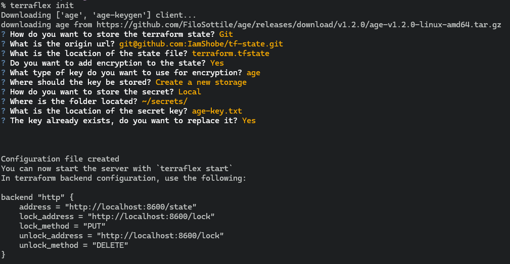

# terraflex
Construct custom backends for your terraform project!

> [!NOTE]  
> This project is still WIP in early stages - there might be some bugs - you are welcome to open issues when any encounted

#### why?
I started this project to provide a solution for free **homelabs** IAC.  
The major constraint here is to find a **free** backend that I feel **safe** to use.  
I found several solutions around this - but most were using a 3rd party hosted [http](https://developer.hashicorp.com/terraform/language/backend/http) backend servers.  
Those backends were problematic for me because I had issues trusting them to store my sensitive state files - and the fact that I didn't own the storage location - made me afraid that I might lose those state files - and we all know how bad it is to lose your state files :P.  
The closest solution I found was [terraform-backend-git](https://github.com/plumber-cd/terraform-backend-git) - which this project was heavily influenced on - so go check it out as well!  
Eventually I had the idea of creating an **extendable modular terraform http backend** - which allows customizing the state using `transformations` (like encryption), and getting starting with it will be as simple as running single command.

## Installation
Recommended apporach is using [pipx](https://github.com/pypa/pipx):
```bash
pipx install terraflex
```

Upgrade using:
```bash
pipx upgrade terraflex
```

## Getting started

### Git backends preparation
- Create new repository to store your state at
- Make sure the repository is initialized with primary branch (`main`)

### Common
- To start - cd to your IAC repo, for example: `~/git/iac`
- Run:
  ```bash
  terraflex init
  ```
  Follow the wizard
- Update your backend:
  ```hcl
  backend "http" {
    address = "http://localhost:8600/state"
    lock_address = "http://localhost:8600/lock"
    lock_method = "PUT"
    unlock_address = "http://localhost:8600/lock"
    unlock_method = "DELETE"
  }
  ```
- Run any terraform command using `terraform wrap -- <command>` - for example:
  ```bash
  terraflex wrap -- terraform init
  ```
- You can also create a full shell with the context of the backend:
  ```bash
  terraflex wrap -- $SHELL
  ```


> [!WARNING]  
> Make sure to not lose your encryption key - back it up!
> If you lose this key you wont be able to reopen the terraform state at all!

## TODO

- [ ] allow for multiple state files
- [ ] git - have a support for different branches
- [ ] onepassword store for encryption key
