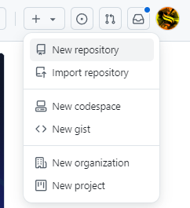
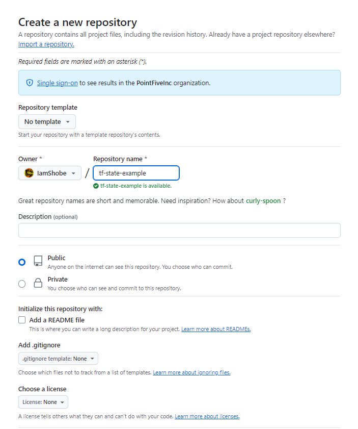
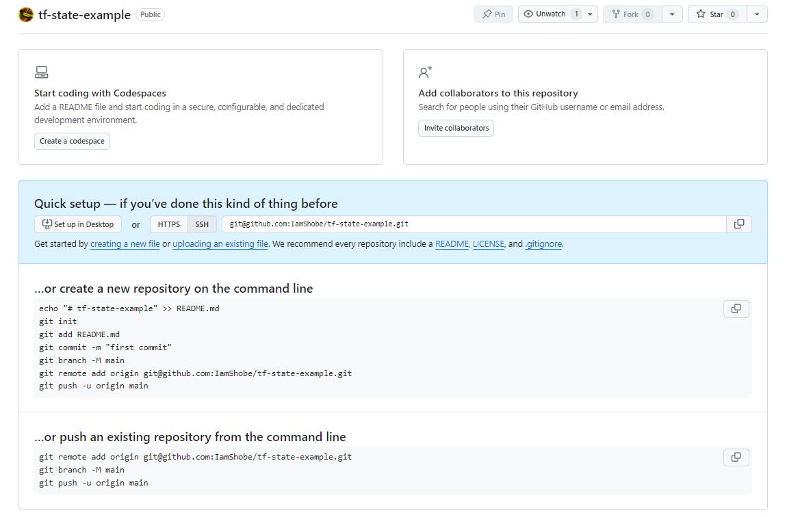
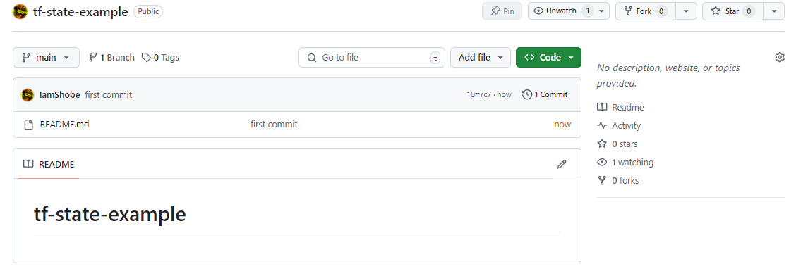
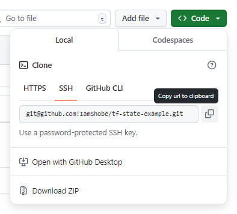
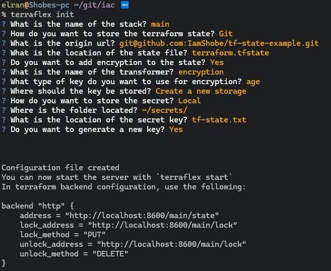
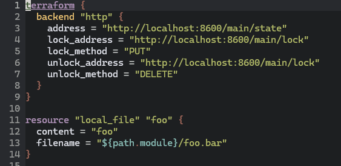
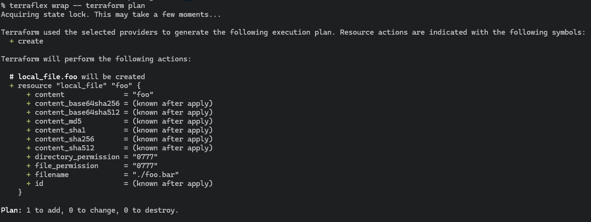

# Setting up git backend

Setting up [git backend](../../reference/storage-providers/git.md) requires a short setup.  
The main advantage with it - is that the "bootstrap" layer for this setup is really minimal - 
and requires basically creating a new repository to store your state at.  
This guide will walkthrough you to create a git backend in [Github](https://github.com/).  
If you already have a repository - skip right to [step 3](#step-3-create-a-terraflexyaml-file-in-your-target-terraform-folder).  

## Architechture

We are going to have total of 2 repositories.  
One repository should be your usual IAC terraform repository - you should already have one - or create a new one.  
The second repository will be to manage the terraform state - and it's recommended to be separately from the IAC repo.  
Terraflex is going to manage this repository automatically - and it's going to be cloned by default at: `~/.local/share/terraflex/git_storage/<state-repo-name>`.  

```kroki-excalidraw
@from_file:./getting-started/guides/assets/git-architecture.excalidraw
```

## Links

Checkout used repositories in this guide:
- [State repository](https://github.com/IamShobe/tf-state-example)
- [IAC](https://github.com/IamShobe/iac-terraflex-example)

## Step 1 - Create a new repository
Login into github open the menu in the top right - and click on `New repository`.  


In the opened form select the owner as your current user or organization.  
Enter a new name for your state repository.  
It's recommended to set the repository visablilty to private - but you can set it to either public or private - 
doesn't really matter (as the state will be encrypted in our example).  
I will create it as public to allow you to see the repository later on.


After creating the repository - you should see something similar to the following:


## Step 2 - Initialize the state repository
Go to your terminal and initialize the state repository in your favorite way.  
In my case I'm going to use the following snippet:
```bash
mkdir tf-state-example
cd tf-state-example
echo "# tf-state-example" > README.md
git init
git add README.md
git commit -m "first commit"
git branch -M main
git remote add origin git@github.com:IamShobe/tf-state-example.git
git push -u origin main
```

!!! failure
    Make sure to adjust the commands to your repository path! - otherwise you will encounter some permissions issues or not found errors etc...

Once done - your repository should look something like that:


Keep the remote origin url:


In my case it's `git@github.com:IamShobe/tf-state-example.git`.

## Step 3 - Create a terraflex.yaml file in your target terraform folder

You can complete this step by either creating this file yourself -  
or automatically using [`terraflex init`](../../reference/commands/init.md).  
In this guide we will be using `terraflex init`.  

Go to your IAC repository - and run:
```console
$ terraflex init
```
A new wizard should be created - follow the instructions and fill all the required fields.



Once done, a snippet should be printed on your screen to allow you to setup the new terraform backend.  
In my example:
```hcl
backend "http" {
    address = "http://localhost:8600/main/state"
    lock_address = "http://localhost:8600/main/lock"
    lock_method = "PUT"
    unlock_address = "http://localhost:8600/main/lock"
    unlock_method = "DELETE"
}
```

## Step 4 - Configuring your terraform backend to work against the new backend
Open your terraform config file and change the backend to the backend snippet from last step:



Save the file and that's it! We are ready to test up everything!

## Step 5 - Initializing backend and migrating state
If you already used the terraform with a different backend - you can migrate the state using:
```console
$ terraflex wrap -- terraform init -migrate-state
```

In my case I'm stating a new IAC repository so I can simply use:
```console
$ teraflex wrap -- terraform init
```

For any terraform command use [`terraflex wrap`](../../reference/commands/wrap.md) to startup the backend while the terraform command is running!  




